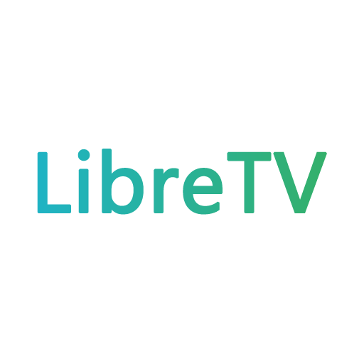

# LibreTV · 自托管影视搜索 + 多用户私有云

<div align="center">
  
  <br>
  <p><strong>自由观影，畅享精彩</strong></p>
  <p>
    聚合多源在线影视搜索 · WebGL 超分辨率 · 中英双语 · 观看历史/收藏云同步 · 多用户账号 · 个人媒体库
  </p>
</div>

---

## 📖 目录

- [项目简介](#-项目简介)
- [功能特性](#-功能特性)
  - [搜索与播放](#1-搜索与播放)
  - [画质增强 / 超分辨率](#2-画质增强--超分辨率)
  - [字幕](#3-字幕)
  - [观看历史 & 收藏](#4-观看历史--收藏)
  - [多用户私有云（账号 + 云同步）](#5-多用户私有云账号--云同步)
  - [个人媒体库（R2，进阶）](#6-个人媒体库r2进阶)
  - [界面 · 主题 · 多语言 · 移动端](#7-界面--主题--多语言--移动端)
  - [隐私与代理](#8-隐私与代理)
- [快速部署](#-快速部署)
- [私有云配置（账号 / KV / R2）](#-私有云配置账号--kv--r2)
- [环境变量与绑定一览](#-环境变量与绑定一览)
- [详细部署指南](#-详细部署指南)
- [iOS App（Capacitor 套壳）](#-ios-appcapacitor-套壳)
- [键盘快捷键](#-键盘快捷键)
- [技术栈](#-技术栈)
- [安全与隐私](#-安全与隐私)
- [免责声明](#-免责声明)
- [致谢与支持](#-致谢与支持)

---

## 📺 项目简介

LibreTV 是一个轻量级、自托管的在线影视搜索与观看平台：聚合来自多个公开采集源（苹果 CMS V10 API）的内容，前端纯静态 + 服务端代理，可部署在 Cloudflare Pages / Vercel / Netlify / Render / Docker 等多种环境。

本仓库在原版基础上做了大量增强，并可选地升级为一个 **Cloudflare 托管的多用户「私有云」**——多人各自登录，观看历史 / 收藏 / 设置按账号云端同步，甚至把自己的视频上传到对象存储在站内串流。

> 本项目基于 [LibreSpark/LibreTV](https://github.com/LibreSpark/LibreTV)（其又重构自 [bestK/tv](https://github.com/bestK/tv)）二次增强。

---

## ✨ 功能特性

### 1. 搜索与播放
- **多源聚合搜索**：内置多个采集源，可在设置里全选/多选；支持**自定义 API**（苹果 CMS V10 格式，可填 detail 地址、标记成人源）。
- **豆瓣热门推荐**：首页可开关豆瓣电影/电视剧榜单与分类标签，一键「换一批」。
- **TMDB 可观看平台**：在影片详情中显示 Netflix / Disney+ 等正版平台并跳转（需填入免费 TMDB API Key）。
- **ArtPlayer + HLS.js** 播放：自动连播、选集（正/倒序）、复制播放链接、锁定控制、画中画、投屏（AirPlay）。
- **断点续看**：自动记录每集播放进度，历史里可从上次位置继续。
- **分片广告过滤**：可开关，过滤 HLS 切片广告。

### 2. 画质增强 / 超分辨率
基于 **WebGL2 实时着色器**的画质增强（非简单 CSS 滤镜），在播放器设置里可选：
- **Anime4K（动画）**：邻域钳制锐化 + 线条加深，几乎无白边。
- **实拍超清（CAS）**：对比度自适应锐化，双线性放大到 1440P/4K，适合电影/纪录片。
- **老剧超清（两遍超分）**：先双边降噪去压缩色块、再 CAS 放大锐化——专为《康熙微服私访记》这类老标清剧设计；**自动模式下 ≤576p 的实拍内容会自动走它**。
- **老片降噪**、**增强强度滑块**（实时可调）、**画质角标**（显示输出分辨率与 ✨ 增强标记）。
- **高性能增强开关**：榨干 GPU 超采样，渲染到更高分辨率（强机/独显更清晰）。

### 3. 字幕
- **检测流内嵌字幕**：自动探测 m3u8 里的内嵌字幕轨（hls.js），检测到即弹提示并在控制栏出现 **CC 按钮**。
- **加载本地字幕文件**：支持 `.srt / .vtt / .ass`，由 ArtPlayer 渲染叠加——**任何视频都能加字幕**（多数国内采集源是硬字幕/无内嵌轨，这条更实用）。

### 4. 观看历史 & 收藏
- **观看历史**：左上面板，按剧聚合、显示进度条、可删除单条/清空。
- **收藏**：顶栏 ❤️ + 收藏面板；详情弹窗「收藏本片」切换；播放页工具栏 ❤️ 收藏当前在看。
- **云同步**：登录账号后，历史 / 收藏 / 设置按用户存到 Cloudflare KV，**多设备共享**；未登录则纯本地，行为不变。

### 5. 多用户私有云（账号 + 云同步）
把单一站点密码升级为**多用户账号系统**（全部跑在 Cloudflare Functions + KV 上）：
- **注册 / 登录 / 登出**：右上角账号按钮 → 弹窗。会话用 HMAC-SHA256 签名 token（HttpOnly Cookie `lt_session`）。
- **密码安全**：服务端用 **PBKDF2-HMAC-SHA256 + 每用户随机盐**存储，**绝不存明文**；登录通用报错防用户枚举。
- **仅管理员可建账号**：注册需填**管理员密码（`ADMINPASSWORD`）当邀请口令**，防止陌生人乱注册占用存储（可用 `OPEN_REGISTRATION=true` 放开）。
- **按用户隔离**：历史 `history:<user>`、收藏 `favorites:<user>`、设置 `settings:<user>` 各自独立。
- **优雅降级**：未配置 / 未登录时完全维持原有本地体验，旧的「用户名 + 站点密码」同步也仍兼容。

### 6. 个人媒体库（R2，进阶）
> 🧪 需要你在 Cloudflare 配置 R2（见下方），未配置时该功能不激活。

- 把**自己的视频文件上传到 Cloudflare R2 对象存储**，在站内浏览/播放——像个人云盘。
- 浏览器经 **S3 兼容 SigV4 预签名 URL 直传 R2**（不经过 Worker，绕过请求体大小限制），单文件 ≤5GB。
- 播放走带 **Range** 的私有串流代理，可拖动；每个对象按 `users/<userId>/...` 前缀做**越权校验**。

### 7. 界面 · 主题 · 多语言 · 移动端
- **液态玻璃设计**：海滩青色玻璃拟态主题，可一键切到**高对比度主题**（无障碍）。
- **中英文切换**：顶栏一键切换，记忆选择；覆盖首页/播放页/关于页的主要界面文案。
- **PWA**：可「添加到主屏幕」，离线壳、独立窗口。
- **移动端适配**：面板自适应小屏、触控目标放大、Esc 关闭面板、键盘焦点环。

### 8. 隐私与代理
- **站点密码保护**（`PASSWORD` / `ADMINPASSWORD`）。
- **黄色内容过滤**开关。
- **自定义代理地址**：设置里可填自建的 `/proxy/` 地址换区域/节点（影响搜索与详情请求）。
- 不存储任何视频内容，仅做搜索与代理转发。

---

## 🚀 快速部署

点击一键部署，快速创建自己的实例（请把仓库地址换成你 fork 的地址）：

[](https://vercel.com/new/clone?repository-url=https%3A%2F%2Fgithub.com%2FLibreSpark%2FLibreTV)
[](https://app.netlify.com/start/deploy?repository=https://github.com/LibreSpark/LibreTV)
[](https://render.com/deploy?repo=https://github.com/LibreSpark/LibreTV)

> 基础功能（搜索/播放/历史本地）开箱即用。**多用户私有云**与**媒体库**是可选的进阶功能，需要在 Cloudflare 后台额外配置（见下一节）。

---

## 🔐 私有云配置（账号 / KV / R2）

> 仅 **Cloudflare Pages** 部署支持完整私有云功能（账号 + 云同步 + 媒体库），因为它用到 Workers KV 与 R2。

### A. 开启「多用户账号 + 历史/收藏/设置云同步」
在 Pages 项目 → **Settings**：
1. **环境变量** `SESSION_SECRET`：一段长随机串（会话签名密钥，**必填**）。
2. **KV 绑定**：Workers & Pages → KV 新建一个命名空间，然后在 **Settings → Bindings** 把它绑为变量名 **`LIBRETV_KV`**（或复用代理缓存用的 `LIBRETV_PROXY_KV`）。
3. **环境变量** `ADMINPASSWORD`：管理员密码，同时作为**注册邀请口令**。
4. **Retry deployment** 重新部署。

> 验证：访问 `/api/me` 应返回 `401`（未登录）而不是 500；用管理员密码当邀请口令注册一个账号，右上角按钮即显示你的用户名。
> 常见报错：`/api/login` 返回 `{"error":"KV 未绑定"}` → 第 2 步 KV 没绑；`{"error":"未配置 SESSION_SECRET"}` → 第 1 步没设。

### B. 开启「个人媒体库（上传到 R2）」
在 A 的基础上，再加：
5. **R2 桶**：建一个 R2 bucket，并在 **Settings → Bindings** 绑为 **`MEDIA_R2`**。
6. **R2 的 S3 API Token**（R2 → Manage R2 API Tokens）→ 设为环境变量：`R2_ACCOUNT_ID`、`R2_BUCKET`、`R2_ACCESS_KEY_ID`、`R2_SECRET_ACCESS_KEY`。
7. **R2 桶 CORS**：允许从你的站点域名发起 `PUT` 与预检（否则浏览器直传会被预检拦下）。

---

## ⚙️ 环境变量与绑定一览

| 名称 | 类型 | 必需 | 作用 |
| --- | --- | --- | --- |
| `PASSWORD` | 环境变量 | 强烈建议 | 站点访问密码 |
| `ADMINPASSWORD` | 环境变量 | 私有云需要 | 管理员密码 / **注册邀请口令** |
| `SESSION_SECRET` | 环境变量 | 账号功能必填 | 会话 token 签名密钥（长随机串） |
| `OPEN_REGISTRATION` | 环境变量 | 可选 | 设 `true` 则放开自助注册（默认仅管理员） |
| `LIBRETV_KV` | KV 绑定 | 云同步/账号必需 | 存用户、历史、收藏、设置、媒体索引（也可用 `LIBRETV_PROXY_KV`） |
| `MEDIA_R2` | R2 绑定 | 媒体库必需 | 存用户上传的视频文件 |
| `R2_ACCOUNT_ID` / `R2_BUCKET` | 环境变量 | 媒体库必需 | R2 端点与桶名 |
| `R2_ACCESS_KEY_ID` / `R2_SECRET_ACCESS_KEY` | 环境变量(Secret) | 媒体库必需 | R2 S3 API 凭证（用于生成预签名上传 URL） |

> TMDB API Key、自定义代理地址、用户名等是**站内设置项**（存 localStorage / 账号），不是环境变量。

---

## 📋 详细部署指南

### Cloudflare Pages（推荐，私有云全功能）
1. Fork 本仓库，在 Cloudflare Pages 连接该仓库；构建命令留空、输出目录留空。
2. 设 `PASSWORD`（及私有云所需的 `SESSION_SECRET` / `ADMINPASSWORD` / KV / R2，见上）。
3. 保存并部署。

### Vercel / Netlify
1. 导入 fork 的仓库，默认设置即可。
2. 在环境变量里设置 `PASSWORD`（可选 `ADMINPASSWORD`）。
> 注：Vercel/Netlify 无 Workers KV/R2，**私有云账号与媒体库不可用**，但搜索/播放/本地历史正常。

### Render
1. 导入仓库，Render 自动识别 `render.yaml`。
2. 默认无密码；如需可在环境变量加 `PASSWORD` / `ADMINPASSWORD`。

### Docker
```bash
docker run -d \
  --name libretv \
  --restart unless-stopped \
  -p 8899:8080 \
  -e PASSWORD=your_password \
  -e ADMINPASSWORD=your_adminpassword \
  bestzwei/libretv:latest
```

### Docker Compose
```yaml
services:
  libretv:
    image: bestzwei/libretv:latest
    container_name: libretv
    ports:
      - "8899:8080"
    environment:
      - PASSWORD=${PASSWORD:-your_password}
      - ADMINPASSWORD=${ADMINPASSWORD:-your_adminpassword}
    restart: unless-stopped
```
```bash
docker compose up -d   # 访问 http://localhost:8899
```

### 本地开发
```bash
cp .env.example .env   # 可选
npm install
npm run dev            # 默认 http://localhost:8080，PORT 可在 .env 改
npm test               # 运行测试
```
> ⚠️ 用纯静态服务器（`python -m http.server` 等）时视频代理不可用、无法播放；请用 Node 开发服务器。

---

## 📱 iOS App（Capacitor 套壳）

`mobile/` 目录提供一个 Capacitor iOS 壳：用 WebView 全屏加载你部署好的站点（详见 `mobile/README.md`）。
```bash
cd mobile
npm install
# 改 capacitor.config.json 的 server.url 为你的域名
npm run add:ios && npm run sync && npm run open   # 然后用 Xcode 签名运行 / TestFlight
```
> 诚实提醒：**自用 / 真机 / TestFlight** 没问题；这类聚合影视源的 App **公开上架 App Store 大概率被拒**（指南 5.2）。

---

## ⌨️ 键盘快捷键

| 按键 | 功能 |
| --- | --- |
| 空格 | 播放 / 暂停 |
| ← / → | 快退 / 快进 |
| ↑ / ↓ | 音量 + / − |
| M | 静音 / 取消 |
| F | 全屏 / 退出全屏 |
| Esc | 退出全屏 / 关闭面板 |

---

## 🛠️ 技术栈

- **前端**：原生 HTML5 + CSS3 + ES6+，Tailwind CSS，玻璃拟态设计系统
- **播放**：ArtPlayer + HLS.js；**WebGL2 着色器**做实时画质增强（Anime4K / CAS / 两遍超分）
- **后端**：Cloudflare Pages Functions / Vercel / Netlify / Node（`server.mjs`，Express）
- **存储**：localStorage（本地）+ **Cloudflare Workers KV**（用户数据）+ **Cloudflare R2**（媒体文件）
- **鉴权**：Web Crypto（HMAC 会话 + PBKDF2 密码）；R2 直传用手写 SigV4 预签名
- **其它**：PWA（Service Worker）、i18n（中/英）、苹果 CMS V10 API、服务端 HLS 代理

---

## ⚠️ 安全与隐私

- **强烈建议设置 `PASSWORD`**：不设密码的实例任何人都能访问，可能被滥用或招致版权投诉。
- **仅供个人/学习使用**，请勿公开分享实例链接或作商业用途。
- **私有云注意**：媒体库让你成为内容存储方，请勿上传/分享侵权内容；账号密码已做 PBKDF2 加盐处理，但仍建议为不同站点使用不同密码。
- 遵守当地法律法规；公开分享导致的任何法律问题由使用者自行承担。

---

## ⚠️ 免责声明

LibreTV 仅作为视频搜索工具，不存储、上传或分发任何（第三方采集源的）视频内容。所有在线搜索结果均来自第三方公开 API。如有侵权，请联系相应内容提供方。开发者不对使用本项目产生的任何后果负责。

---

## 🎉 致谢与支持

- 上游项目：[LibreSpark/LibreTV](https://github.com/LibreSpark/LibreTV) · [bestK/tv](https://github.com/bestK/tv)
- 播放/超分：[ArtPlayer](https://github.com/zhw2590582/ArtPlayer)、[hls.js](https://github.com/video-dev/hls.js)、[Anime4K](https://github.com/bloc97/Anime4K)

如果这个项目对你有帮助，欢迎为公益捐赠：

[](https://www.msf.hk/zh-hant/donate/general?type=one-off)
